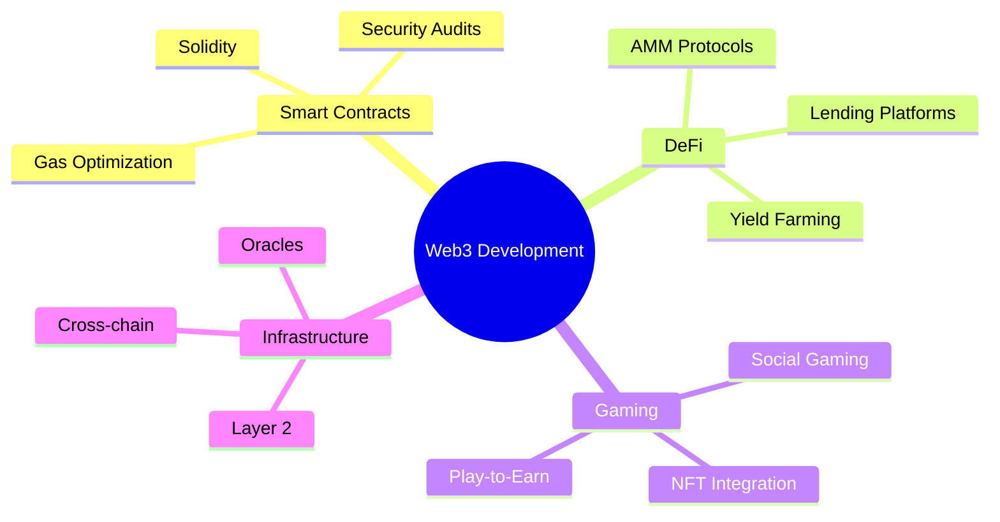

<div align="center">

# 🚀 Welcome to My Crypto Universe
### Building the Future of Web3, One Block at a Time


</div>

---

<div align="center">

## 🌟 **About Me**

```javascript
const developer = {
    name: "0Cmxh",
    focus: ["Blockchain", "DeFi", "Smart Contracts", "Web3"],
    specializes: ["Solidity", "Ethereum", "Base", "Chainlink"],
    currentProject: "JackpotGacha - Farcaster MiniApp",
    philosophy: "Code is Law, Decentralization is Freedom"
};
```

</div>

---

## 🛠️ **Tech Stack**

<div align="center">

### **Blockchain & Web3**


### **Frontend Development**


### **Tools & Platforms**


</div>

---

## 📊 **GitHub Analytics**

<div align="center">


</div>

<div align="center">

[](https://git.io/streak-stats)

</div>

---

## 🚀 **Featured Projects**

<div align="center">

### 🎰 **JackpotGacha - Farcaster MiniApp**
[](https://github.com/0Cmxh/JackpotGacha-MiniApp-Farcaster-Test)

**🔹 Decentralized Social Raffle Game**
- 🎯 Smart Contract with **Chainlink VRF v2.5**, **Price Feeds** & **Automation**
- 🎮 **$0.10 USD tickets** with automatic ETH conversion
- 🏆 **Top 5 Jackpot** system with √ticket weighting
- 💰 **85% random refunds** via Chainlink VRF
- 📱 **Farcaster MiniApp** with native wallet integration
- ⚡ **2-hour automated rounds** on Base Network

</div>

---

## 🌐 **Blockchain Networks**

<div align="center">

| Network | Status | Focus |
|---------|--------|--------|
|  | 🟢 Active | DeFi Protocols |
|  | 🟢 Active | MiniApps & Gaming |
|  | 🟡 Exploring | Scaling Solutions |
|  | 🟡 Exploring | L2 Development |

</div>

---

## 💡 **Current Focus Areas**

<div align="center">



</div>

---

## 🎯 **Specializations**

<div align="center">

### **🔐 Smart Contract Security**
- ✅ Reentrancy Protection
- ✅ Access Control Patterns
- ✅ Gas Optimization
- ✅ Audit Best Practices

### **🔗 Oracle Integration**
- ✅ Chainlink Price Feeds
- ✅ VRF for Randomness
- ✅ Automation Networks
- ✅ Cross-chain Data

### **🎮 GameFi Development**
- ✅ On-chain Gaming Logic
- ✅ NFT Integration
- ✅ Social Features
- ✅ Economic Models

### **🌐 Web3 Frontend**
- ✅ Wallet Integration
- ✅ dApp Architecture
- ✅ Real-time Updates
- ✅ Mobile Optimization

</div>

---

## 📈 **Activity Graph**

<div align="center">

[](https://github.com/ashutosh00710/github-readme-activity-graph)

</div>

---

## 🏆 **Achievements & Badges**

<div align="center">


[](https://github.com/0Cmxh)
[](https://github.com/0Cmxh)

### **🌟 Contribution Highlights**
- 🎯 **Smart Contract Developer** focused on security and efficiency
- 🔗 **Chainlink Integration Specialist** for reliable oracle solutions
- 🎮 **GameFi Pioneer** building social gaming experiences
- 🚀 **Web3 Innovator** creating user-friendly decentralized applications

</div>

---

## 🤝 **Let's Connect**

<div align="center">

[](https://twitter.com/0Cmxh)
[](https://discord.gg/yourdiscord)
[](https://t.me/yourtelegram)
[](mailto:0xsttk@gmail.com)

</div>

---

<div align="center">

### 💫 **"Building the decentralized future, one smart contract at a time"**

```solidity
pragma solidity ^0.8.0;

contract LifePhilosophy {
    string public constant MOTTO = "Code is Law, Innovation is Key";

    function buildTheFuture() public pure returns (string memory) {
        return "Decentralized, Transparent, Unstoppable";
    }
}
```

**⭐ Star my repositories if you find them useful!**

</div>

---

<div align="center">
  
</div>